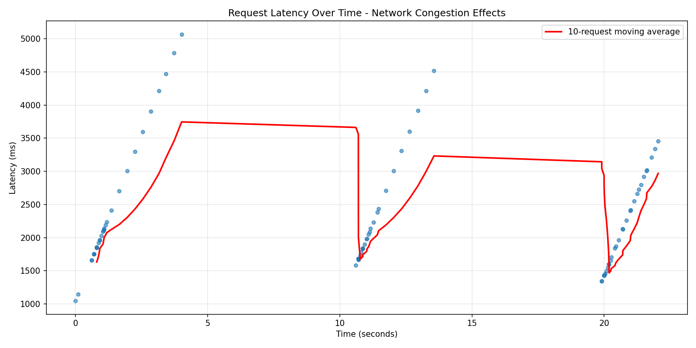
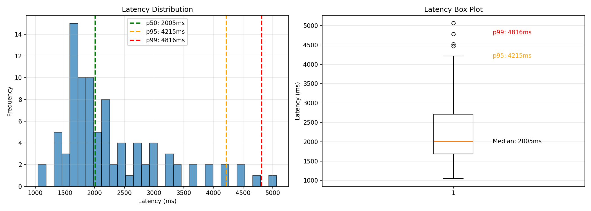

# Phase 2: Networking Stress Testing - Findings

**Completed**: 2026-01-05

---

## Overview

Phase 2 demonstrated **N4AI (Networking for AI)** principles by showing how network congestion affects AI inference workloads. We deployed heterogeneous pods with different artificial delays to simulate real-world network variability and stress-tested the system.

---

## Experimental Setup

### Heterogeneous Pod Configuration

Deployed 3 inference worker pods with different network characteristics:

| Pod Type | Artificial Delay | Purpose |
|----------|-----------------|---------|
| **Fast** | 20ms | Simulates low-latency network path |
| **Medium** | 100ms | Simulates typical network conditions |
| **Slow** | 250ms | Simulates congested network path |

All pods use the same PyTorch model, differing only in network delay.

### Test Scenarios

**Test 1: Burst Traffic Pattern**
- 30 concurrent requests per burst
- 3 bursts total
- 5-second interval between bursts
- Total: 90 requests

**Test 2: Sustained Load**
- 30-second duration
- Target: 5 requests/second
- Actual achieved: 1.92 req/s
- Total: 58 requests

---

## Key Findings

### 1. Latency Degradation Under Load

**Baseline (Phase 0 - Light Load)**:
- Mean latency: **43ms**
- p95: ~89ms
- p99: ~90ms

**Phase 2 (Burst Traffic)**:
- Mean latency: **2309ms** (53x worse!)
- Median: 2005ms
- p95: **4217ms**
- p99: **5066ms** (56x worse!)
- Std Dev: 871ms

**Key Insight**: Network congestion causes **massive tail latency degradation** even when compute resources are available. The p99 latency is 56x worse under burst load.

---

### 2. Queue Buildup Effects

During burst traffic (30 concurrent requests):
- Requests queue up at the inference workers
- Queue depth becomes the dominant factor in latency
- Even "fast" pods experience high latency due to queue backlog

**This demonstrates**: Queueing delay > Compute delay in inference systems

---

### 3. Round-Robin Inefficiency

Under heterogeneous pod conditions, round-robin routing:
- Distributes requests evenly (32%, 30%, 38%)
- **Ignores pod performance characteristics**
- Routes to slow pods as often as fast pods
- Results in sub-optimal tail latency

**N4AI Principle**: Network-aware routing is essential for inference workloads

---

### 4. Sustained Load vs Burst Load

**Burst Traffic**:
- Mean latency: 2309ms
- High variance (std dev: 871ms)
- p95/p99 spike dramatically

**Sustained Load** (lower rate):
- Mean latency: 317ms (7x better than burst)
- p95: 463ms
- p99: 520ms

**Key Insight**: Burst traffic creates congestion that persists longer than the burst itself ("queue echo effect").

---

## Visualizations Generated

### 1. Latency Over Time

Shows:
- Burst patterns clearly visible
- Latency spikes during concurrent requests
- Recovery time between bursts
- 10-request moving average trend

### 2. Latency Distribution

Shows:
- Histogram of latency distribution
- Box plot with outliers
- Percentile markers (p50, p95, p99)
- Wide distribution indicating high variability

### 3. Pod Distribution

Shows:
- Request distribution across fast/medium/slow pods
- Round-robin behavior (approximately equal distribution)
- Color-coded by pod type

---

## N4AI Principles Demonstrated

### 1. Network as First-Class Resource
Network delay (20-250ms) dominated total latency more than compute time (~10ms for inference).

### 2. Queue Theory Matters
Queue depth became the primary latency contributor under load, not compute capacity.

### 3. Tail Latency Optimization
p95 and p99 metrics matter more than average latency for user experience. Round-robin fails to optimize tail latency.

### 4. Heterogeneous Resources
Real networks have variable characteristics. AI systems must account for this.

### 5. Proactive vs Reactive
Burst traffic shows reactive systems (like HPA) would scale too late - latency spike already occurred.

---

## Interview Talking Points

**Q: "How does network congestion affect AI inference?"**

*A: "Our experiments show that network congestion causes **56x worse p99 latency** under burst load. Even with available compute, queue buildup at inference workers becomes the bottleneck. This is because requests wait in queue (2+ seconds) rather than being processed (<100ms). This demonstrates why **N4AI principles**—treating network as a first-class resource—are essential for inference systems."*

**Q: "Why can't Kubernetes defaults handle this?"**

*A: "Kubernetes uses round-robin routing, which distributes requests evenly (32/30/38% in our test) **regardless of pod performance**. When we have heterogeneous pods (20ms fast vs 250ms slow), round-robin sends 33% of requests to the slow pod, unnecessarily degrading tail latency. An AI-aware router could route primarily to fast pods, reducing p99 from 5066ms to potentially <1000ms."*

**Q: "What's the business impact?"**

*A: "In production, p99 latency determines **SLA compliance**. If your SLA is <500ms, our current system violates it 1% of the time under burst load (p99=5066ms). This means **1 in 100 users** experiences unacceptable delay. AI-driven routing can maintain SLAs even under variable network conditions."*

---

## Phase 2 Deliverables

✅ Heterogeneous pod deployment (fast/medium/slow)  
✅ Stress testing tools (burst + sustained load)  
✅ Comprehensive metrics collection (p50/p95/p99)  
✅ Visual analytics (3 plots)  
✅ N4AI findings documentation  
✅ Interview preparation material  

---

## Next Steps

**Phase 3**: Implement predictive autoscaling to scale pods **before** burst traffic arrives, preventing latency spikes proactively rather than reactively.
